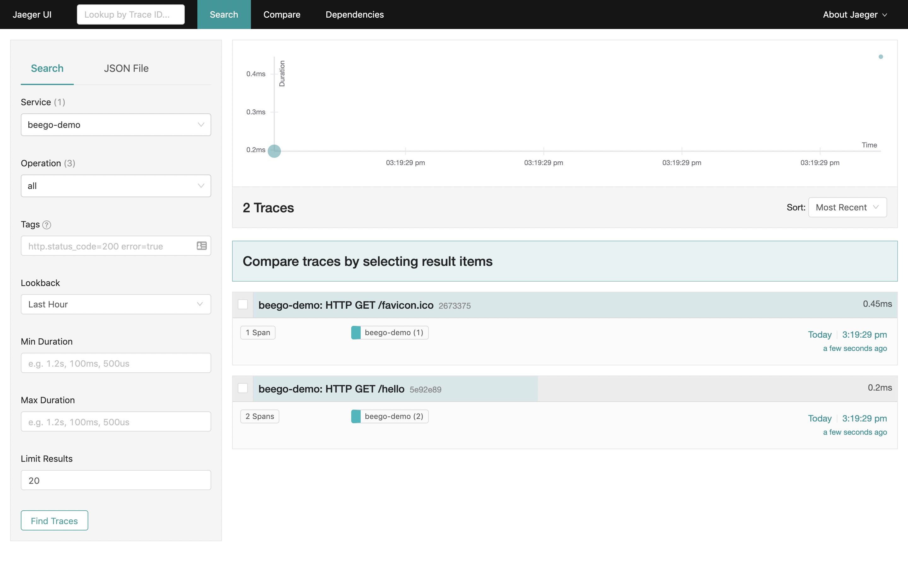
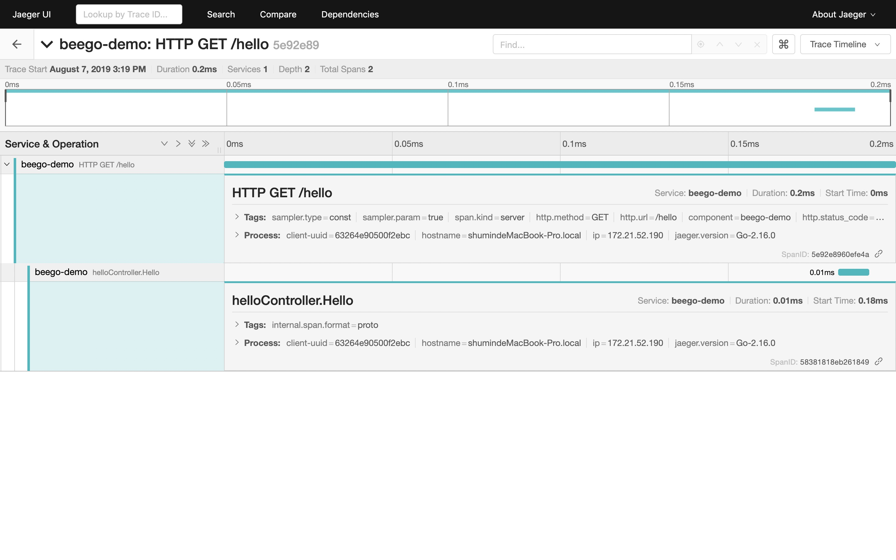

# beego
a middleware for the beego web framework to use opentracing


```go
import (
	"github.com/astaxie/beego"
	apmbeego "github.com/opentracing-contrib/beego"
    "github.com/opentracing/opentracing-go"
)

const (
	DefaultComponentName = "beego-demo"
)

type helloController struct{ beego.Controller }

func (this *helloController) Hello() {
	span, _ := opentracing.StartSpanFromContext(this.Ctx.Request.Context(), "helloController.Hello")
	defer span.Finish()
	this.Ctx.WriteString("hello world")
}

func main() {
    
	beego.Router("/hello", &helloController{}, "get:Hello")

	//  use the middleware
	beego.RunWithMiddleWares("localhost:8080", apmbeego.Middleware(DefaultComponentName))

}
```

Example: [beego-example](./examples)




